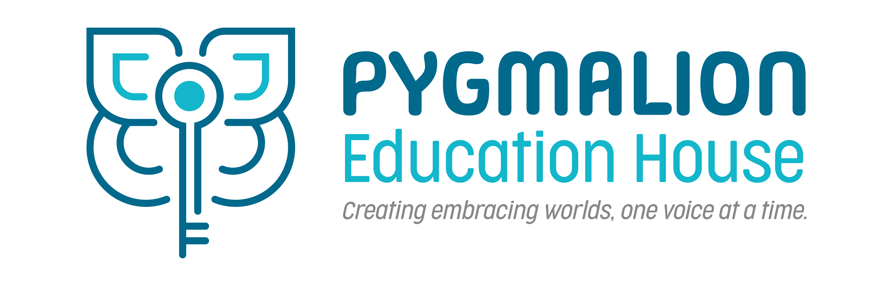

<div align="center">
  
</div>

# Pygmalion - Plataforma Educativa
<div align="center">
  
  
  
  
</div>

## 📋 Descripción
Pygmalion es una plataforma educativa moderna desarrollada con React y TypeScript, enfocada en proporcionar una experiencia educativa transformadora y accesible.

## 🚀 Tecnologías Utilizadas

### Core
- React 18
- TypeScript
- Vite (como bundler)
- Tailwind CSS
- Framer Motion (para animaciones)

### Estilos
- PostCSS
- CSS Variables
- CSS Modules
- Sistema de diseño propio con fuentes personalizadas (Funtastic y Garet)

## 📦 Instalación

1. Clona el repositorio:
```bash
git clone https://github.com/andersoncamero/pygmalion.git
```

2. Instala las dependencias:
``` bash
    pnpm install
```

3. Inicia el servidor de desarrollo:
``` bash 
    pnpm dev
```


🏗️ Arquitectura
Estructura de Carpetas

src/
├── components/
│   ├── UI/          # Componentes reutilizables
│   ├── layout/      # Componentes de estructura
│   ├── pages/       # Páginas principales
│   └── sections/    # Secciones de página
├── interfaces/      # TypeScript interfaces
└── utils/          # Utilidades y helpers

1. Patrones de Diseño
    * Component Composition
    * Uso de composición sobre herencia
    * Componentes altamente reutilizables
    * Props typing con TypeScript

2. Atomic Design
    * Átomos (botones, inputs)
    *  Moléculas (cards, forms)
    * Organismos (secciones)
    * Templates (layouts)
    * Páginas

3. Custom Hooks
    * Separación de lógica y UI
    * Reutilización de funcionalidad

🎨 Sistema de Diseño
Tipografía
    *   Fuente Principal: Funtastic (títulos)
    * Fuente Secundaria: Garet (texto)
Colores
--color-primary: #00698c
--color-secondary: #13b6cb
--color-light: #e8e3dd
--color-gray: #706f6f
--color-dark: #1d1d1b
--color-yellow: #ffd481
--color-orange: #e68447
--color-purple: #854698


Componentes UI
    * Buttons
    * Cards
    * Carousels
    * Dropdowns
    * Image Collages
    * Tabs
    *Menus
🔄 CI/CD
    * Control de versiones con Git
    * Desarrollo en rama develop
    * Producción en rama main
    * Despliegue automático con [especificar plataforma]

Responsive Design
1. Mobile First
2. Breakpoints:
    * sm: 640px
    * md: 768px
    * lg: 1024px
    * xl: 1280px
🎭 Animaciones
1. Uso de Framer Motion para:
    * Transiciones suaves
    * Animaciones de entrada
    * Efectos de hover
    * Carruseles automáticos