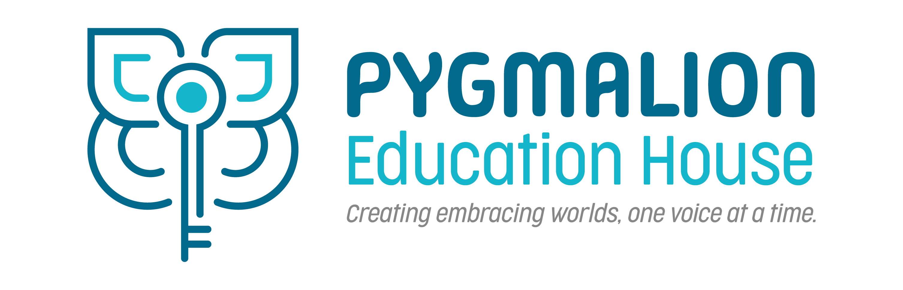

<div align="center">
  
</div>

# Pygmalion - Plataforma Educativa

<div align="center">
  
  
  
  
</div>

## 📋 Descripción

Pygmalion es una plataforma educativa de vanguardia desarrollada con **React 19** y **TypeScript**. El proyecto está diseñado para ofrecer una experiencia de aprendizaje fluida, estética y altamente interactiva, utilizando las últimas tecnologías del ecosistema web.

## 🚀 Tecnologías Utilizadas

### Core Stack
- **React 19**: Aprovechando las últimas mejoras en rendimiento y hooks.
- **TypeScript**: Tipado estático para un desarrollo robusto y mantenible.
- **Vite 7**: Bundler ultrarrápido para una experiencia de desarrollo óptima.
- **Tailwind CSS 4**: Estilizado moderno con alto rendimiento y personalización.
- **Motion**: Librería profesional para animaciones fluidas y micro-interacciones.
- **React Router 7**: Gestión eficiente de la navegación y rutas.

### Herramientas de Desarrollo
- **Lucide React**: Set de iconos elegantes y consistentes.
- **Sharp / TSX**: Utilizados en scripts personalizados para el procesamiento de imágenes.
- **ESLint**: Garantía de calidad y consistencia en el código.

## 🏗️ Arquitectura y Estructura

El proyecto sigue una estructura organizada basada en principios de modularidad y escalabilidad:

```text
src/
├── components/
├── components/
│   ├── atoms/       # Componentes básicos (Botones, Iconos, Logo)
│   ├── molecules/   # Grupos de átomos (MenuItems, Tabs)
│   ├── organisms/   # Secciones complejas (Header, Footer, Hero)
│   ├── templates/   # Estructuras de página (MainContent)
│   └── pages/       # Vistas finales de la aplicación (HomePage)
├── hooks/           # Hooks personalizados para lógica reutilizable
├── interfaces/      # Definiciones de tipos y contratos (TypeScript)
├── utils/           # Funciones de utilidad y helpers comunes
└── assets/          # Recursos estáticos como estilos globales
```

## 🛠️ Principios SOLID Implementados

Este proyecto prioriza la mantenibilidad y la legibilidad mediante la aplicación de los principios **SOLID**:

1.  **S (Single Responsibility Principle)**: Cada componente tiene una única razón para cambiar. Los componentes de UI se encargan exclusivamente de la presentación, mientras que la lógica compleja se extrae a *hooks* personalizados.
2.  **O (Open/Closed Principle)**: Los componentes están diseñados para ser extensibles mediante *props* y composición, permitiendo añadir nuevas funcionalidades sin modificar el código fuente del componente original.
3.  **L (Liskov Substitution Principle)**: Las interfaces en `src/interfaces/` aseguran que los tipos sean intercambiables y respeten los contratos establecidos.
4.  **I (Interface Segregation Principle)**: Los componentes solo reciben las *props* estrictamente necesarias para su funcionamiento, evitando dependencias innecesarias.
5.  **D (Dependency Inversion Principle)**: Se utiliza la inyección de dependencias a través de *props* para desacoplar componentes y facilitar las pruebas.

## 🖼️ Optimización de Imágenes

Contamos con herramientas integradas para garantizar el mejor rendimiento visual:

-   **`pnpm check-image-sizes`**: Analiza el tamaño de las imágenes en `public/` y sugiere optimizaciones.
-   **`pnpm optimize-images`**: Procesa automáticamente las imágenes para convertirlas a formatos modernos (WebP, AVIF) y ajustar su resolución.

## 📦 Instalación y Desarrollo

1.  **Clonar el repositorio:**
    ```bash
    git clone https://github.com/andersoncamero/pygmalion.git
    ```

2.  **Instalar dependencias:** (Se recomienda pnpm para mayor velocidad)
    ```bash
    pnpm install
    ```

3.  **Iniciar el entorno de desarrollo:**
    ```bash
    pnpm dev
    ```

4.  **Construir para producción:**
    ```bash
    pnpm build
    ```

---
<div align="center">
  Desarrollado con ❤️ para transformar la educación digital.
</div>